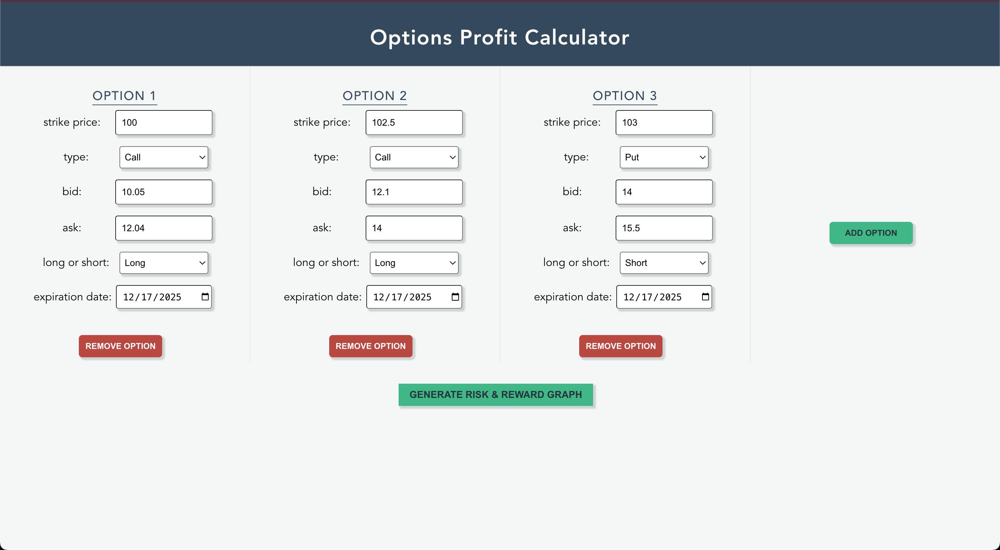

## Options Profit Calculator

A Vue application that generates a risk & reward graph for options strategies. The component accepts an input of four options contracts and outputs the following:
1. A risk & reward graph where X is the price of the underlying at the time of expiry and Y is the profit/loss at that price. 
2. Max profit, max loss, and all break even points.

